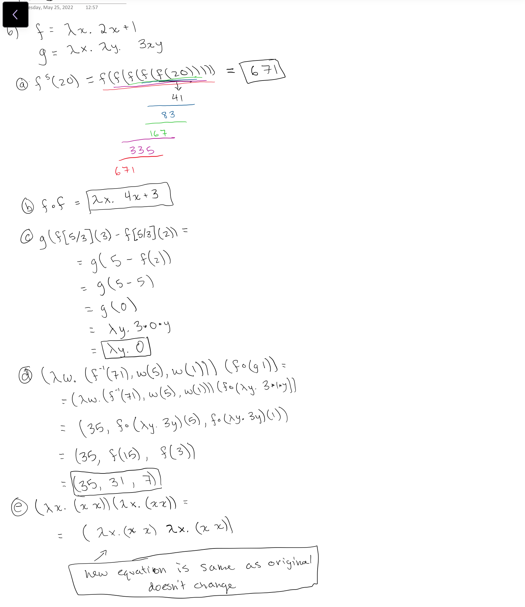
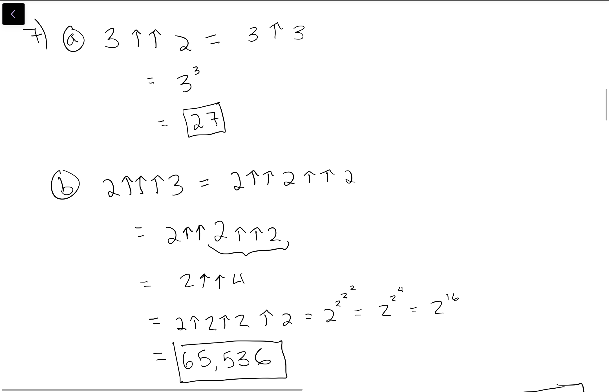
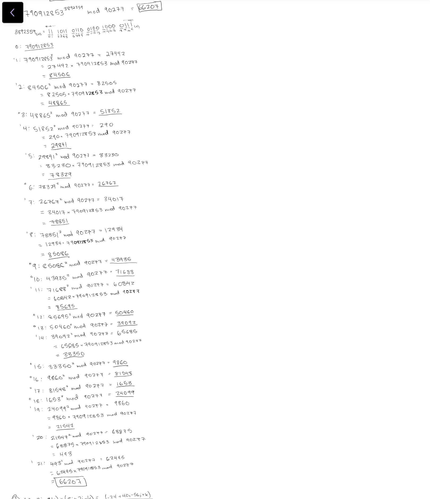
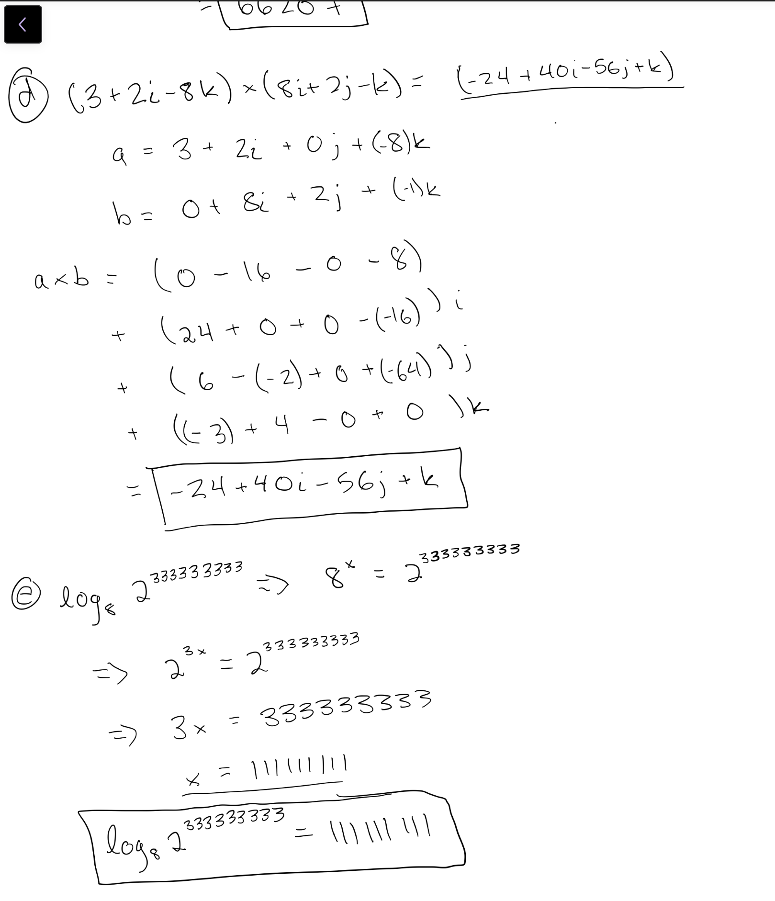
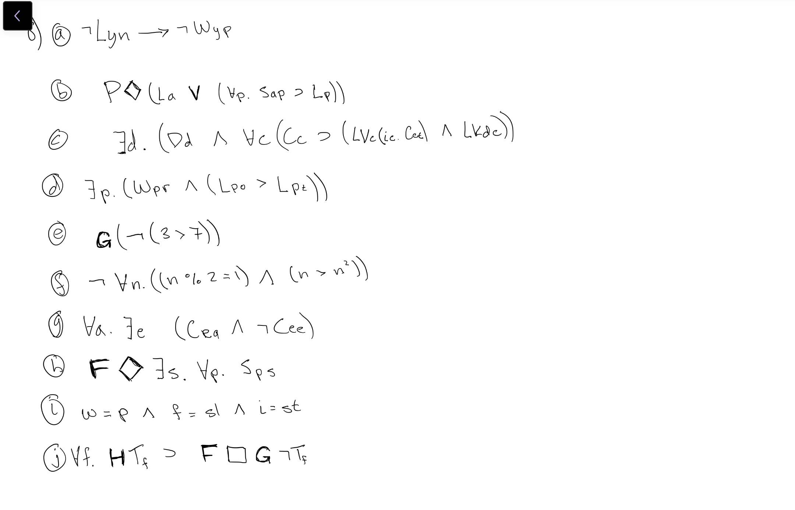

# Homework 1

### Adrian Leung, Nick Morgan, Jason Kalili

<br>

## Problem Set

<ol>
<br><li><h3>On the course notes page entitled “The Study of Programming Languages” we saw a function written in several programming languages. Write this function in a language not on this list. Prove that your function works on a tio.run or replit.com page. Include the link to your code in your answer.</h3>

<i>Link: https://tio.run/##bY7LCsIwEEXX5itmIzSaha26zJeIhKITGGknNg/J38cEaVduhsM998K80kRjn0uxiR@RHENIs3HW4AfZhCWNHkOXpYAmQMOpknUecMIZOQIxZLEDILtFexhAt2aNf7Oj3uRhpWaRn2K9tScaibcnjt2/N269GtRZXdT1LmUpXw</i>

```julia
function sum_of_even_squares(x)
  sum = 0
  for element in x
	  if element % 2 == 0
	    sum += element * element
	  end
  end
  sum
end
```

<li><h3>In your own words, write one sentence for each of the four major theories of computation, conveying its central question and its areas of concern. Write as if your job depended on clarity, accuracy, and solid English writing skills.</h3>

<p><u>Language Theory:</u> Theorizes how all computations are expressed and information is represented as strings of symbols from a finite alphabet to convey some meaning.</p>
<p><u>Automata Theory:</u> The study of machines, or automata, and how their limited features can be used to solve problems.</p>
<p><u>Computability Theory:</u> Fundamentally speaking, what are the limits of computation, and how does computability pertain to a function on the natural numbers?</p>
<p><u>Complexity Theory:</u> Theorizes the practical time and space resources required so run a computation or solve a problem</p>

<h3><li>In the Theories of Computer Science lecture we saw how to express the odd-number test in Lambda Calculus notation, Lisp, Python, JavaScript, Java, Ruby, Clojure, and Swift. Show how, in each of these notations or languages, to express a function to cube a number. (Research may be required.)</h3>

Lisp

```Lisp
(LAMBDA (x) (expt x 3))
```

Python

```Python
lambda x: x**3
```

Javascript

```JavaScript
x => x**3
```

Java

```Java
x -> x*x*x
```

Ruby

```Ruby
->(x) {x**3}
```

Clojure

```Clojure
#(* %1 (* %1 %1))
```

Swift

```Swift
{(x:Int) -> Int in return(x*x*x)}
```

<br><li><h3>Mark each of the following as true or false:

<ol style = 'list-style-type: lower-latin;'>
    <li>∅∈∅ <u>False</u> 
    <li>∅∈{∅} <u>True</u> 
    <li>∅⊆∅ <u>True</u> 
    <li>∅⊆{∅} <u>True</u> 
    <li>{x,y}⊆P({x,y,{x,y}}) <u>True</u>
    <li>P(∅)={∅} <u>True</u> 
    <li>{x,y,z}^3−{s∣|s|≤3}≠∅ <u>True, if s refers to sets since a set has unique elemnts and {x,y,z}^3 can have repeated elements. False, if s refers to tuples of length equal to or less than 3 since {s∣|s|≤3} would contain every possible tuple that is in {x,y,z}^3.</u> 
    <li>⋃{N,B,Q}−B=Q <u>True</u> 
    <li>(9,3,F)∈Z×B×R∧(1,2)↓1=2 <u>True</u>
    <li>|P({a,b,c})−P({a,b})|=5 <u>False</u>
</ol>
</h3>
<br><li><h3>Is the intersection of two partial orders a partial order? If so, prove it. If not, give a counterexample.</h3>
<p>The interesection of two partial order will always be a partial order. We will call the first initial partial order A and the other B. Let's assume that both partial orders A, B are both on a set S. Since, both A and B are partial orders they are reflexive thus for any x in S there exists a (x, x) in both A and B, thus (x, x) must also be in A∩B. Now, lets assume the opposite that A∩B is not antisymmetric. In this case there are a pair of tuples (x,y) and (y,x) in A∩B, thus (x,y) and (y,x) must be in both A and B. However, we know this can not be true or else A and B would not be partial orders to start. Thus by contradiction we proved that A∩B is antisymmetric. Now lastly, lets assume that (x,y) and (y,z) are in A∩B. For A∩B to be transitive it would also need the tuple (x,z). Since the tuples (x,y) and (y,z) are in A∩B then both tuples are in A and B individually. Since A and B are partial orders and must be transitive then we know that the tuple (x,z) must be in A and B individually. Thus since (x,z) is in both A and B then (x,z) is in A∩B and thus proving A∩B is also transitive. We have now proved that A∩B is reflexive, antisymmetric, and transitive thus proving A∩B is a partial order.</p>

<i>Used:
https://math.stackexchange.com/questions/2057729/prove-or-disprove-if-r-and-s-are-partial-order-relations-on-a-set-a-then-r-c to help answer this question. </i>

<li><h3>Let f=λx.2x+1 and g=λx.λy.3xy. Reduce each of the following expressions (or if they cannot be reduced, say why):</h3>

<ol style = 'list-style-type: lower-latin;'>
    <li>f5(20) => 671
    <li>f∘f => 4x+3
    <li>g(f[5/3](3)−f[5/3](2)) => g(0) => λy.3*0*y => λy.0
    <li>(λw.(f−1(71),w(5),w(1)))(f∘(g1)) => (35, 31, 7)
    <li>(λx.(xx))(λx.(xx)) => new reduction is same as original equation thus it can not be reduced.
</ol>

<br>

<i> work below (also in assests) </i>



<br><li>Give exact answers to each of the following:

<ol style = 'list-style-type: lower-latin;'>
    <li>3↑↑2 => 27
    <li>2↑↑↑3 => 65536
    <li>790912853^(3892359)mod90277 => 66207
    <li>(3+2i−8k)×(8i+2j−k) => -24 + 40i - 56j + k       
    <li>log8(2^(333333333)) => 111111111
</ol>

<br>

<i> work below (also in assests) </i>





<br><li>Translate the following sentences into logical notation.

<ol style = 'list-style-type: lower-latin;'>
    <li>If you don't leave now, you will not win the prize.
    <li>Ani or her sisters might have been late.
    <li>Some dogs like cats who live in the capital of Turkey.
    <li>The person who won the race prefers orange juice to tea.
    <li>3 will never be greater be 7.
    <li>Not every odd number is greater than its own square.
    <li>Something evil caused all evil things except itself.
    <li>Some day, it will be possible that all players will have the same score.
    <li>War is peace, freedom is slavery, and ignorance is strength.
    <li>All that was once true will someday necessarily be forever false.
</ol>
<br>



<br><li><h3>In classical logic, ∃ and ∀ are duals of each other, because (¬∃x.P)≡∀x.¬P and (¬∀x.P)≡∃x.¬P. Are the temporal operators F and G duals of each other? Why or why not?</h3>

<p>Yes, F and G are duals of each other and hold true for the same cases as ∃ and ∀. In the same way in which ∃ and ∀ relate to a possible existance and a necessary existance, F and G relate to the same premise and ideas respectively. The case ¬F(e)≡G(¬e) holds true because in the case which a particalar event [e] will not happen at any point in the future [¬F(e)] is the same as saying that it will forever be the case that said particular event does not happen [G(¬e)]. Vis Versa holds true for ¬G(e)≡F(¬e) because if it will not forever be the case where a particular event [e] happens [¬G(e)], is the same as saying it will at some point be the case in which the particular event [e] doesn't happen [F(¬e)].</p>

<li><h3>Suppose that you had a classical, bivalent logistic system powerful enough to express statements about the provability of its own formulas, for example, “This formula is not provable” or equivalently “I am not provable.” Show that such a system, if consistent, must be incomplete, and if complete, must be inconsistent.</h3>

<p>
Consider a logic system with the potential to express statements about the provability of its own formulas.

If the statement 'I am not provable' is true, then for the system to be consistent, the statement 'I am provable' must be false. This would lead to a true value in the case of verifying the second statement. However, in the case that both of these statements are true, the truth values would create a contradiction leading to an inconsistent system.

If the statement 'I am not provable' is false, there exists additional systems that must have been used to verify the truth of this statement.
These systems having not been included in the original system implies the incompleteness of that system.

</p>

</ol>
