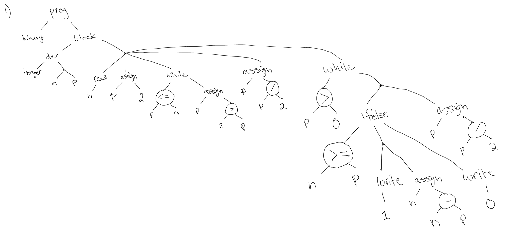
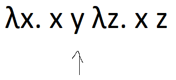
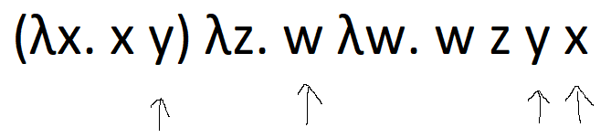
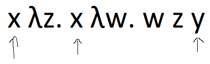
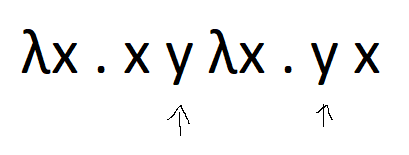
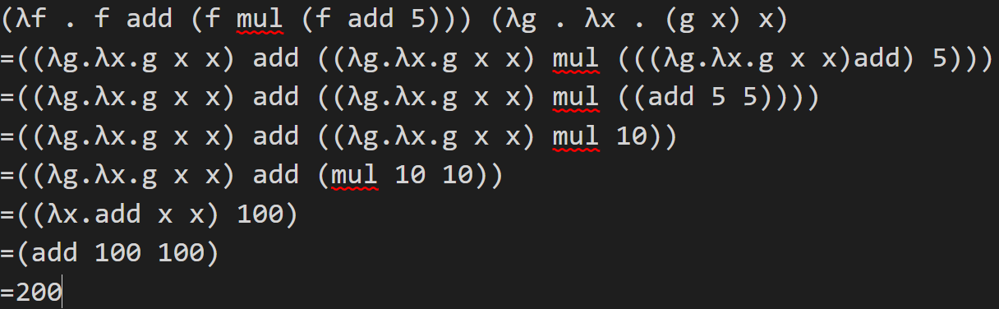
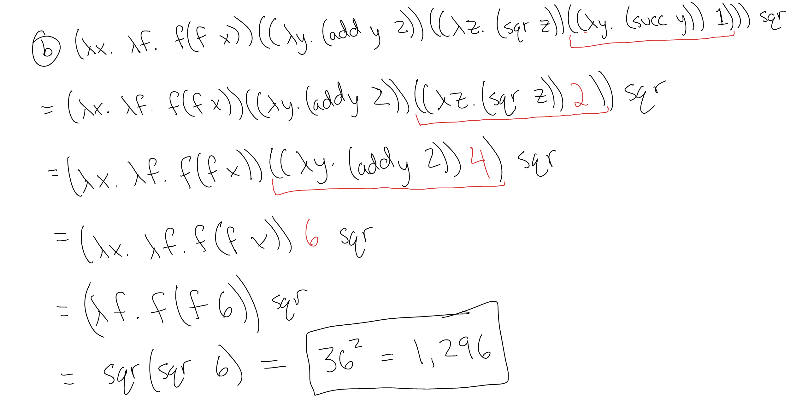
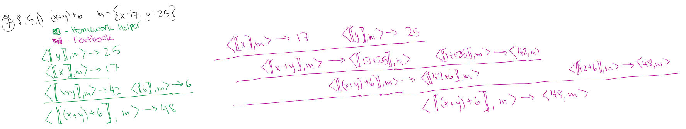
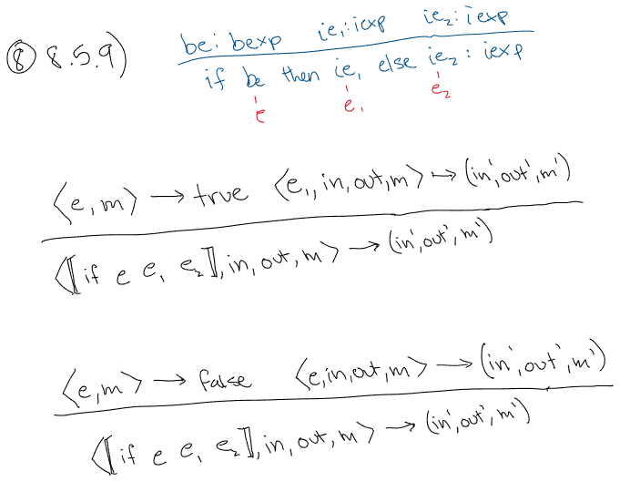
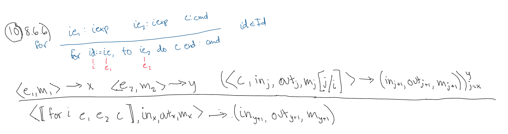

# Homework 3

### Adrian Leung, Nick Morgan, Jason Kalili

<br>

## Problem Set

<!--  -->

<h3>1. Problem 1.4.3 in Slonneger and Kurtz -

Draw an abstract syntax tree for the following Wren program:</h3>

```
program binary is
  var n,p : integer ;
begin
  read n; p := 2;
  while p<=n do p := 2*p end while ;
  p := p/2;
  while p>0 do
    if n>= p then write 1; n := n–p else write 0 end if;
    p := p/2
  end while
end
```



<h3>2. Problem 5.1.1 in Slonneger and Kurtz -

Correctly parenthesize each of these lambda expressions:

<ol style = 'list-style-type: lower-latin;'>
    <li> λx. x λy. y x <br><u>(λx.( x λy.( y x)))</u>
    <li> (λx. x) (λy. y) λx. x (λy. y) z <br><u>(λx. (x λy. (y λx. (x λy. (y z)))))</u>
    <li> (λf. λy. λz. f z y z) p x <br><u>(λf. (λy. (λz. (f z y z)))) p x </u>
    <li> λx. x λy. y λz. z λw. w z y x <br><u>(λx.x)(λy.y)(λz.(z(λw.w)zyx)</u> 
</ol>
</h3>

<h3>3. Problem 5.1.2 in Slonneger and Kurtz -

Find the set of free variables for each of the following lambda expressions:

<ol style = 'list-style-type: lower-latin;'>
  <li> λx. x y λz. x z <br>



  <li> (λx. x y) λz. w λw. w z y x <br>



  <li> x λz. x λw. w z y <br>



  <li> λx. x y λx. y x <br>



</ol>

</h3>

<h3>4. Problem 5.1.3 in Slonneger and Kurtz -

Carry out the following substitutions:

<ol style = 'list-style-type: lower-latin;'>
    <li> (f (λx. x y) λz. x y z)[x→g] <br><u>(f (λx. x y) λz. g y z)</u>
    <li> (λx. λy. f x y)[y→x] <br><u>(λx. λy. f x y)</u>
    <li> ((λx. f x) λf. f x )[f→g x] <br><u>((λy. gx y) λf. f x )</u>
    <li> (λf. λy. f x y)[x→f y] <br><u>(λg. λz. g fy z)</u> 
</ol>
</h3>

<h3>5. Problem 5.2.3 in Slonneger and Kurtz -

Use call by value semantics to reduce the following lambda expressions:

<ol style = 'list-style-type: lower-latin;'>

  <li> (λf . f add (f mul (f add 5))) (λg . λx . (g x) x) <br>



  <li> (λx . λf . f (f x)) ((λy . (add y 2)) ((λz . (sqr z)) ((λy . (succ y)) 1))) sqr <br>



</ol>
</h3>

<h3>6. Problem 5.2.7 (a) in Slonneger and Kurtz -

Translate these “let” expressions into lambda expressions and reduce them. Also write the expressions using “where” instead of “let”.

<ol style = 'list-style-type: lower-latin;'>
    <li> let x = 5 in let y = (add x 3) in (mul x y) <br><u>((λx. (λy. mul x y) (add x 3))5) ; 40</u>
</ol>
</h3>

<h3>7. Problem 8.5.1 in Slonneger and Kurtz -

Evaluate the Wren expression “(x+y)+6” using the store, sto = {x|→17,
y|→25}. Draw a derivation tree that shows the applications of the inference rules.



</h3>

<h3>8. Problem 8.5.9 in Slonneger and Kurtz -

Extend Wren to include conditional integer expressions with the abstract syntax

```
  be : bexp ie₁ : iexp ie₂ : iexp
  ________________________________
  if be then ie₁ else ie₂ : iexp
```

and add inference rule(s) to give them meaning.



</h3>

<h3>9. Problem 8.6.3 in Slonneger and Kurtz -

Add these language constructs to Wren and provide meaning for them by defining inference rules for their semantics.

</h3>

a.

```
   be : bexp c : cmd
_______________________
repeat c until be : cmd
```


c.

```
swap (id₁,id₂) : cmd      id₁,id₂∈Id
```


<h3>10. Problem 8.6.6 in Slonneger and Kurtz -

Extend Wren to include a definite iteration command of the form:

```
     ie₁ : iexp ie₂ : iexp c : cmd
  ___________________________________  id∈Id
  for id := ie₁ to ie₂ do c end : cmd
```

whose informal semantics agrees with the for command in Pascal. Add inference rules to the structural operational semantics of Wren to give a formal semantics for this new command.



</h3>
