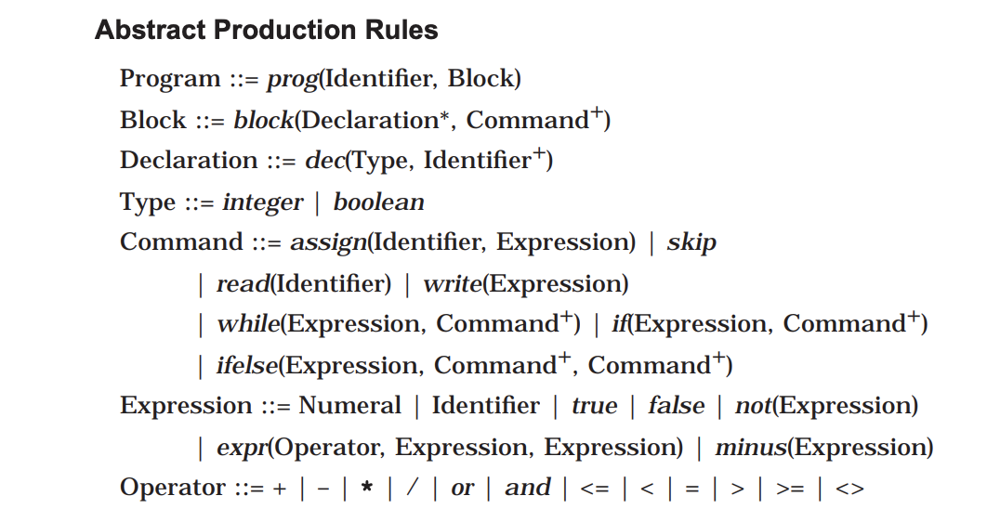

# Homework 4

## Adrian Leung, Nick Morgan, Jason Kalili

<br>

## Problem Set

<!--  -->

<h3><b>1. Problem 9.1.5 in Slonneger and Kurtz -</b>

This is a BNF specification (and abstract syntax) of the language of Roman numerals less than five hundred. <br>
Roman ::= Hundreds Tens Units<br>
Hundreds ::= ε | C | CC| CCC | CD<br>
Tens ::= LowTens | XL | L LowTens | XC<br>
LowTens ::= ε | LowTens X<br>
Units ::= LowUnits | IV | V LowUnits | IX<br>
LowUnits ::= ε | LowUnits I<br>

The language of Roman numerals is subject to context constraints that
the number of X’s in LowTens and I’s in LowUnits can be no more than
three. Remember ε represents the empty string.
Provide semantic functions and semantic equations for a denotational
definition of Roman numerals that furnishes the numeric value of each
string in the language. Assume that the context constraints have been
verified by other means.

```
romanh t u = hundredsh + tenst + unitsu
hundredsε = 0
hundreds"C" = 100
hundreds"CC" = 200
hundreds"CCC" = 300
hundreds"CD" = 400
tenslt = lowtenslt
tens"XL" = 40
tens"L" lt = 50 + lowtenslt
tens"XC" = 90
lowtensε = 0
lowtenslt "X" = lowtenslt + 10
unitslu = lowunitslt
units"IV" = 4
units"V" lu = 5 + lowunitslu
units"IX" = 9
lowunitsε = 0
lowunitslu "I" = lowunitslu + 1
```

<h3><b>2. Problem 9.2.6 in Slonneger and Kurtz -</b>

Add to the calculator a key sqr that computes the square of the value in
the display. Alter the semantics to model the action of this key. Its syntax should be similar to that of the +/- key

```
using "calculate +/- (a,op,d,m) = (a,op,minus(0,d),m)" as an example:

calculatesqr(a, op, d, m) = (a, op, times(d,d), m)
```

<h3><b>3. Problem 9.3.1 in Slonneger and Kurtz - </b><br>
<b> Add these language constructs to Wren and provide their denotational
semantics.</b><br>
a) repeat-until command
Command ::= ... | repeat Command until Expression<br>

```
executerepeat C until Es = fix(λf. λs.
    let s' = executeCs in
        if evaluateEs' then s' else f(executeCs'))
```

b) conditional expression
Expression ::= ... | if Expression then Expression else Expression
Use your definition to prove the semantic equivalence of
m := if E<sub>1</sub> then E<sub>2</sub> else E<sub>3</sub> and if E<sub>1</sub> then m:=E<sub>2</sub> else m:=E<sub>3</sub>.<br>

```
evaluateif e1 then e2 else e3s =
    if evaluatee1s then evaluatee2s else evaluatee3s
```

<h3><b>4. Problem 9.3.9 in Slonneger and Kurtz -</b><br>
Consider the language of propositional logic, which contains symbols
from the following syntactic domains:<br>
var : Var = { p, q, r, p1, q1, r1, p2, q2, … } Propositional variables<br>
con : Con = { t, f } Propositional constants<br>
uop : Uop = { ~ } Unary operation<br>
bop : Bop = { ∧, ∨, ⊃, ↔ } Binary operations<br>
<ol style = 'list-style-type: lower-latin;'>
<li>Give a BNF grammar for the concrete syntax of the language (wellformed formulas) of propositional logic.

```
Grammar
--------------------------------
Form    → Const | Var | "(" Uop Form ")" | "(" Form Bop Form ")"
Var     → Var subscript(digit) | "p" | "q" | "r" | ε
Const   → "t" | "f"
Uop     → "~"
Bop     → "∧" | "∨" | "⊃" | "↔"
```

<li> Describe an abstract syntax of this language in terms of the syntactic
variables for the syntactic domains.

```
Abstract Syntax
-------------------------------
v: Var
c: Const
u: Uop     ="~"
b: Bop     ="∧" | "∨" | "⊃" | "↔"
f: Form    = c | v | u f | f b f
```

<li>Provide a denotational definition that gives meaning to the formulas
in the language of propositional logic, specifying the semantic
domain(s), the syntax of the semantic function(s), and the semantic
equations that define the semantics of the language. One parameter
to the semantic functions will be a function assigning Boolean values
to the propositional variables.
</ol>

```
Denotational Semantics
-------------------------------
eval : form → Interpretation → {true, false}
eval〚T〛φ = true
eval〚F〛φ = false
eval〚v〛φ = φ(v)
eval〚~A 〛φ = if eval〚A〛φ = true then false else true
eval〚(A ∧ B)〛φ = true, if eval〚A〛φ = true and eval〚B〛φ = true else false
eval〚(A ∨ B)〛φ = false, if eval〚A〛φ = false and eval〚B〛φ = false else true
eval〚(A ⊃ B)〛φ = false, if eval〚A〛φ = true and eval〚B〛φ = false else true
eval〚(A ↔ B)〛φ = true, if eval〚A〛= true and eval〚B〛= true else false
```

<h3><b>5. Problem 10.1.2 in Slonneger and Kurtz -</b>
Give a recursive definition of binary trees whose leaf nodes contain natural
number values.<br>

```
Tree = ℕ ∪ (Tree x Tree)
```
